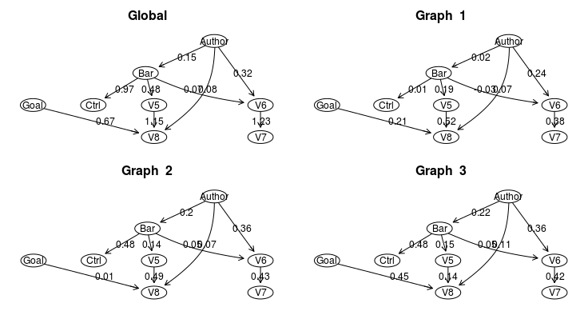
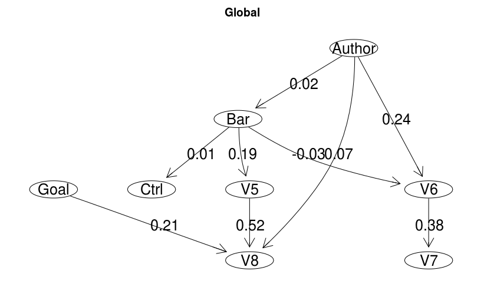

```{r setup, include = FALSE, eval=TRUE,}
knitr::opts_chunk$set(
	eval = TRUE,
	collapse = TRUE,
	comment = "#>",
	include = FALSE
)
```

## IMaGES Algorithm

  IMaGES (Independent Multi-sample Greedy Equivalence Search) is a score-based 
  algorithm that greedily maximizes a score function similar to the one used
  in the pcalg implementation of GES. It modifies the scoring by creating a
  global score across all datasets and uses this score to determine which 
  step from the individual datasets best represents all of the datasets. It 
  accomplishes this by using forward, backward, and turning steps as described
  below:

  - __Forward phase__ In the forward phase, IMaGES moves through the space of
  essential graphs in steps that correspond to the addition of a single edge
  in the space of DAGs; the phase is aborted as soon as the score cannot be
  augmented any more.
  
  - __Backward phase__ In the backward phase, the algorithm performs moves
  that correspond to the removal of a single edge in the space of DAGs until
  the score cannot be augmented any more.
  
  - __Turning phase__ In the turning phase, the algorithm performs moves
  that correspond to the reversal of a single arrow in the space of DAGs
  until the score cannot be augmented any more.
  

  These operations are carried out and result in a global representative graph
  and a Markov Equivalence Class.


### IMaGES in R

#### Description

Running this on the provided sample data returns an IMaGES object with a named list containing: 
- __.global__ a named list containing \code{.graph}, the global graphNEL
       object, and ```.params```, the Structural Equation Modeling data for the global graph
- __.single.graphs__ a list containing named lists of the same structure as above that corresponds to each individual dataset passsed into IMaGES

- __.markovs__ a list containing named lists of the same structure as above that corresponds to each Markov Equivalence Class (the size of which is specified by the user)
- __.means__ a list containing the mean values for the SEM data for each edge in the graph
- __.std.errs__ a list containing the standard errors for the SEM data for each edge in the graph
- __.graphs__ A list containing the individual graph information, including raw graph data, score information, and intermediary variables

#### Usage

The IMaGES class is a Reference Class, which means it must called as such:

```{r echo=TRUE, warning=FALSE, include=TRUE}
require(IMaGES)

data(IMData)

#run IMaGES
im.fits <- IMaGES(matrices=data.list, penalty=3, num.markovs=5)

```


### plotAll

#### Description

This function takes the object returned by an IMaGES run and plots the global structure with its SEM (structural equation modeling) data, as well as the SEM data for each dataset imposed on the global structure. The function determines the dimensions that most closely represent a square and plots the graphs in that fashion.

#### Usage

```{r eval=FALSE, warning=FALSE, include=TRUE}
require(IMaGES)

## Load predefined data
data(IMData)

#run IMaGES
im.fits <- IMaGES(matrices=data.list, penalty=3, num.markovs=5)

#plot global graph and all individual graphs with own SEM data
plotAll(im.fits)
```



### plotMarkovs

#### Description

This function takes the object returned by an IMaGES run and plots the global structure with its SEM (structural equation modeling) data, as well as the SEM data for each Markov Equivalence Class (MEC) and their respective structures. The function determines the dimensions that most closely represent a square and plots the graphs in that fashion.

#### Usage

```{r eval=FALSE, warning=FALSE, include=TRUE}
require(IMaGES)
## Load predefined data
data(IMData)

#run IMaGES
im.fits <- IMaGES(matrices=data.list, penalty=3, num.markovs=5)

#plot global graph alongside Markov Equivalence Class
plotMarkovs(im.fits)
```


### plotIMGraph

#### Description

This function takes a graph object returned from IMaGES (takes the form of a named list containing ```.graph``` and ```.params```) and plots it. Using ```plotAll``` or ```plotMarkovs``` is recommended unless you only want to see one specific graph.

#### Usage

```{r eval=FALSE, warning=FALSE, include=TRUE}
require(IMaGES)

## Load predefined data
data(IMData)

#run IMaGES
im.fits <- IMaGES(matrices=data.list, penalty=3, num.markovs=5)

#plot individual graph
plotIMGraph(im.fits$results$.single.graph[[1]])

```



